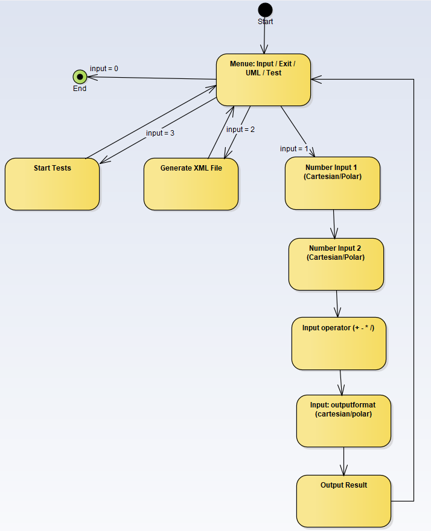
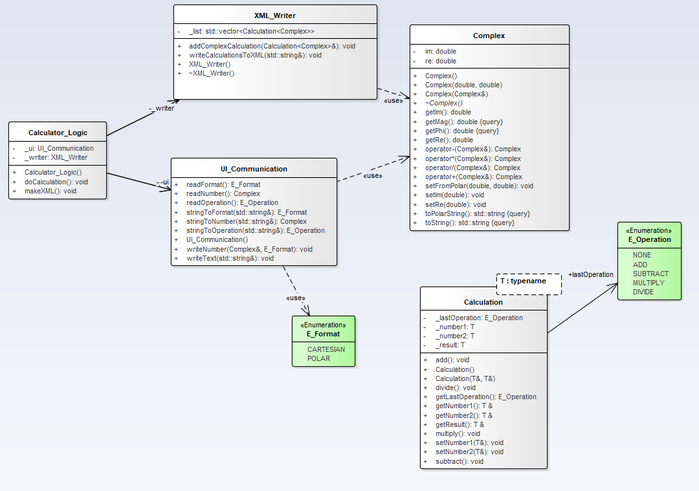
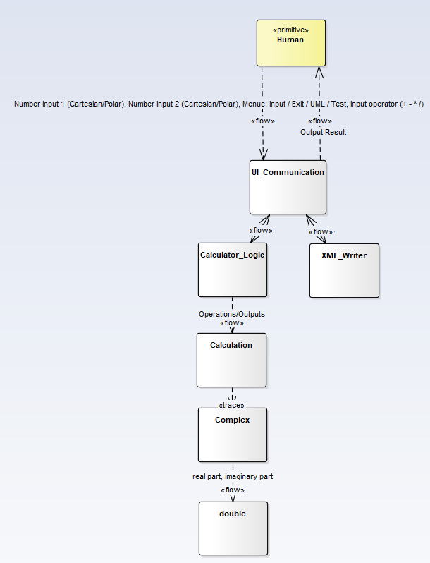
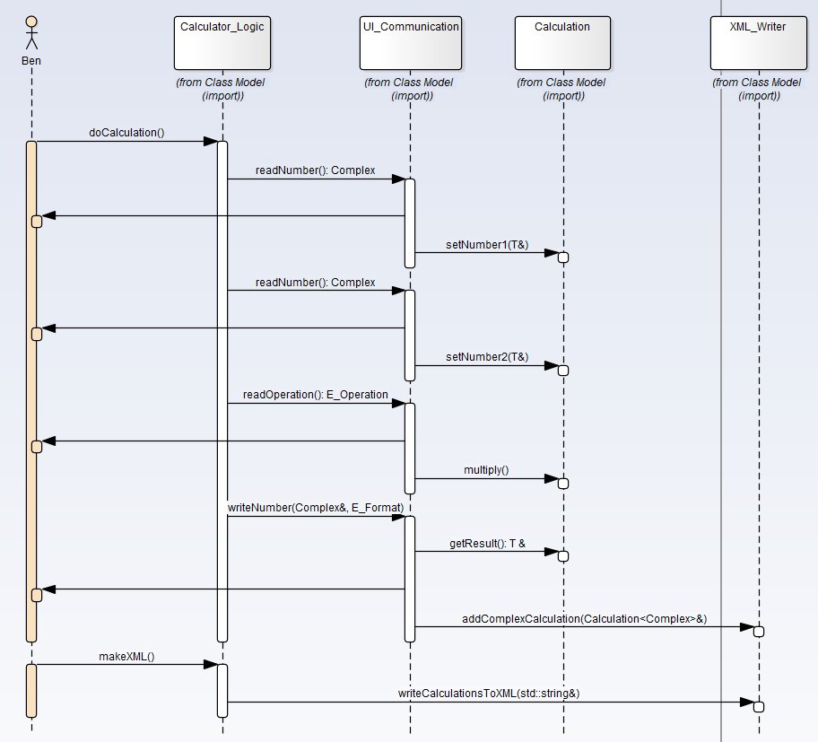
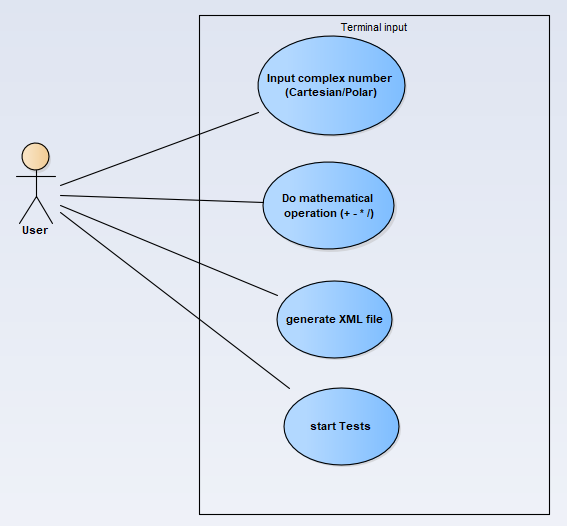

# Informatik_4_Projekt
Veröffentlicht im GitHub Repository: https://github.com/iMazze/Informatik_4_Projekt
## Aufgabenstellung
Rechner für komplexe Zahlen
- Einlesen einer komplexen Zahl über die Konsole (Koeffizienten ODER Exponential- Darstellung)
- Einlesen einer zweiten komplexen Zahl über die Konsole (Koeffizienten ODER Exponential- Darstellung)
- Verarbeitung der beiden Zahlen (Grundrechenarten)
- Speicherung von Eingaben und Ergebnis als XML (Koeffizienten- UND Exponential-
Darstellung)
- Ausgabe des Ergebnisses über die Konsole (mit Nachfrage, ob Koeffizienten ODER
Exponential-Darstellung) 

Anstöße:
- Empfohlene XML-Bibliothek: LibXml2 (via NuGet)
- Einlesen/Ausgabe und BL als Bibliotheken/Module des Hauptprogramms

## Abgabe Dateien
- Ordner mit compiliertern Kommandozeilenprogramm (complex_calculator.exe) wie zugehörigen Librarys (Moodle)
- PDF Dokumentation (Moodle)
- Projekt - Sourcefolder (Moodle)
- GitHub Repository (https://github.com/iMazze/Informatik_4_Projekt)

## Von uns verwendete Conventions
Documentation Style C++: http://doxygen.nl/manual/docblocks.html  
Markdownfile Readme: https://github.com/adam-p/markdown-here/wiki/Markdown-Cheatsheet

## UML Diagramme
Activity Diagramm 

 
Class Diagramm  

 
Domain Diagramm 

 
Sequenz Diagramm 

 
Use-Case Diagramm 

## Compilieren der Software Complex_Calculator
Abgabe des "Rohprojekts" via Moodle: Librarys müssen eigenständig gedownloaded werden
- Entpacken der *.zip Datei "Informatik_4_Projekt.zip"
- Öffnen der Datei Source/complex_calculator/complex_calculator.sln mit Visual Studio (2017)
- Umstellen auf Debug -> x86 Projekt
- Fehlende Packages laut Datei Source\complex_calculator\complex_calculator\packages.conf via NuGET herunterladen
- NuGET via Rechtsklick auf Projektmappe im Projektmappenexplorer -> NuGET Pakete Wiederherstellen oder NuGET Pakete für Projektmappe verwalten

Projekt via Github: Projekt ist nach dem Clonen sofort kompilierbar
- Clonen des Projekts mit `git clone https://github.com/iMazze/Informatik_4_Projekt.git`
- Öffnen der Datei Source/complex_calculator/complex_calculator.sln mit Visual Studio (2017)

Beide:
- Compilieren mit `Erstellen -> Projektmappe Erstellen`
- Debugging mit `Lokaler Windows-Debugger`

## Ordnerstruktur
Informatik_4_Projekt
- README.md: Aktuelles File mit allen Infos zum Programm
- doxygen
  - Doxyfile: Doxygen Konfiguration
  - html/index.html: Gerenderte Dokumentation
- Source/complex_calculator
  - complex_calculator.sln: Visual Studio Projektdatei
  - Debug: compilierte *.exe Files
  - complex_calculator: Ordner mit C++ und H Dateien
  - packages: Abhängigkeiten von Libraries
- UML
  - diagrams.EAP: Enterprise Architect Projekt der Diagramme
  - export: Ordner mit allen gerenderten PDF Dateien

## Kurzanleitung zur Software Complex_Calculator
### Ausführung des Programms
Ziel des Informatik 4 Projekt war es, ein Rechner für komplexe Zahlen zu entwickeln. Dabei soll sowohl die Eingabe als polar- (a+bi) als auch kartesische (xe^i(phi)) Koordinaten möglich sein. Am Ende soll die Rechnung als XML-Datei gespeichert werden.  
Nach dem Kompilieren des Projekts stehen den Anwender 4 Auswahlmöglichkeiten zur Verfügung. Er kann 0) das Programm schließen, 1) den Komplex Rechner ausführen, 2) eine XML Datei erstellen oder 3) die Testcases durchführen und einsehen. Grafisch aufbereitet ist dieses Verhalten in dem aufgeführte Activity Diagramm.  
Wählt der Nutzer 1) Komplex Rechner, kann er seine gewünschte Rechnung durchführen in dem er die erste komplexe Zahle in polar xe^i(phi) oder kartesischer (a+bi) Form gefolgt von einem Operator (+,-,*,/) und einer zweiten komplexen Zahl in karteischer oder polarer Form über die Konsole eingibt. Das Ergebnis wird ihm in der Konsole gezeigt.  
Nach der Durchführung der Rechnung gelangt der Nutzer wieder zum Ausgangspunkt des Programms und kann sich nun wieder zwischen 0) das Programm zu schließen, 1) eine weitere Rechnung durchzuführen 2) die durchgeführte Rechnung in einer XML-Datei zu speichern oder 3) die Test durchzuführen entscheiden. Lässt der Nutzer eine XML Datei erstellen, wird diese unter:
`\Informatik_4_Projekt\Source\complex_calculator\complex_calculator\Berechnungen_Complex_2020-06-05_11-57.xml`
abgelegt. In der XML Datei ist sowohl die Rechnung als auch das Ergebnis in polar UND kartesischen Koordinaten gespeichert.

### Abstrahierung der Layer
In unserem Programmentwurf war es uns wichtig nach dem ISO-OSI Schichtmodell eine sinnvolle Softwareabstrahierung zu Generieren. Durch sinnvolle Abstrahierung ist eine verbesserte Lesbarkeit des Programmcodes und eine Widerverwendbarkeit der Klassen gewährleistet. Das Klassen Diagramm kann unter 
`\Informatik_4_Projekt\UML\export`

eingesehen werden.     Als oberste Schicht stellt die `Calculator_Logic` Klasse die Anwendung dem Nutzer zur Verfügung. Sie erbt von `XML_Write` und `UI_Communication`. In `XML_ Write` wird der gesamte Prozess zum Erstellen der XML Datei gehandelt. `UI_Communication` dagegen handelt sämtliche Nutzer In/Outputs in der Konsole. Es war uns wichtig die Kommunikation mit dem Nutzer smart zu gestalten und wollten nicht mit sämtlichen Abfragen z.B. der Darstellung Komplexität erzeugen. Nach dem KISS Prinzip (Keep it simple and stupid) soll der Nutzer so intuitiv wie möglich den Rechner nutzen können. Um dies zu gewährleisten arbeiten wir mit String Manipulationen und suchen nach Merkmalen in der Nutzereingabe um auf die jeweilige Darstellung zuschließen.   
Als Basis des Programmes dient die Klasse `Complex`, in welcher unser eigenend komplexen Datentyp und sämtliche Operationen mit komplexen Zahlen (+,-,*,/) implementiert sind. Intern nutzt die Klasse die kartesische Darstellung (a+bi) einer komplexen Zahl. Um wiederrum polar Koordinaten verwenden zu können, wurden gewissen Transformationsfunktionen implementiert. Für die eigentlliche Rechenoperation mit den komplexen Zahlen haben wir die Template Klasse 'Calculation' implementiert. Der Vorteil einer Template Klasse ist, dass sie für verschiedene Datentypen eingesetzt werden können. In unserem Rechner wird bsp. unser eigener komplexer Datentyp (complex) verwendet. Andererseits können durch die Template Klasse auch andere Rechner mit z.B. dem Double Datentyp implementiert werden. In unseren Testcases haben wir die Klasse mit zwei verschiedenen Datentypen (complex und std::float) überprüft. 

### Lebenszeit der Objekte
Zur Optimierung der Laufzeit haben wir darauf geachtet, dass Objekte der verschiedenen Klassen nur zu dem benötigten Zeitpunkt erstellt werden und für die notwendige Dauer leben. Im Sequenzdiagramm sieht man z.B. das ein Objekt der Klasse `Calculator_Logic` über die gesamte Programmlaufzeit lebt. Dies ist nötig da der Programmablauf in ihr definiert ist. Als anderes Beispiel, ist ein Objekt der Klasse `Rechnung` nur dann aktiv wenn zwei komplexe Zahlen und ein Operator über die Konsole eingeben wurden. Gleichermaßen ist der XML_Writer nur dann aktiv wenn der Nutzer sich entscheidet seine Rechnungen als XML Datei zu speichern.  

### Errorhandling
Alle möglichen auftretenden Fehler (unseres Wissenstands entsprechend) werden als std::Exception ausgegeben. Bedeutet dass bei auftreten dieser Fehler via `throw` ausgelöst wird.  
Zur Laufzeit erkennt dann die Klasse Calculator_Logic (welche auch die komplette Aufrufhierarchie beinhaltet), falls so ein Fehler auftritt.  
Darauf wird die aktuelle Operation abgebrochen sowie ein Fehler wie in der Datei "Messages.h" beschrieben an den User ausgegeben.

### Unit - Tests
Unsere Testcases sind alle via dem Framework Catch2 implementiert, welches sich als eine einzige *.hpp Datei ins Projekt einbinden lässt. 
Die Testcases decken folgende Klassen ab: complex, calculation (einmal mit std::int, einmal mit complex), XML_Writer, UI_Communication, Calculator_Logic.
Wir haben versucht alle möglichen Grenzfälle sowie Spezial-Fälle abzudecken. 

# Nur für Autoren relevant
## push Files with size>100Mbits:
- $ git rm --cached your_giant_file
- $ git commit --amend -CHEAD
- $ git push

