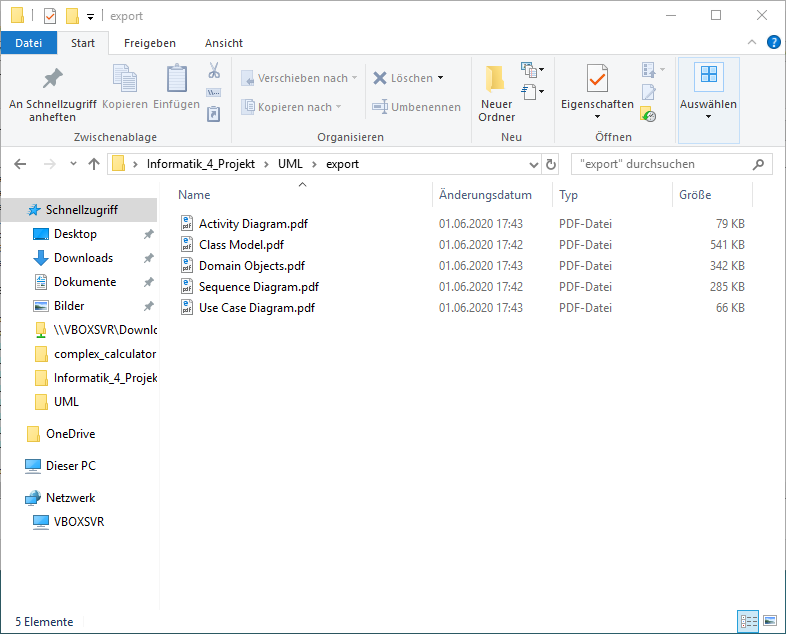

# Informatik_4_Projekt
Veröffentlicht im GitHub Repository: https://github.com/iMazze/Informatik_4_Projekt
## Aufgabenstellung
Rechner für komplexe Zahlen
- Einlesen einer komplexen Zahl über die Konsole (Koeffizienten ODER Exponential- Darstellung)
- Einlesen einer zweiten komplexen Zahl über die Konsole (Koeffizienten ODER Exponential- Darstellung)
- Verarbeitung der beiden Zahlen (Grundrechenarten)
- Speicherung von Eingaben und Ergebnis als XML (Koeffizienten- UND Exponential-
Darstellung)
- Ausgabe des Ergebnisses über die Konsole (mit Nachfrage, ob Koeffizienten ODER
Exponential-Darstellung) 

Anstöße:
- Empfohlene XML-Bibliothek: LibXml2 (via NuGet)
- Einlesen/Ausgabe und BL als Bibliotheken/Module des Hauptprogramms

## Von uns verwendete Conventions
Documentation Style C++: http://doxygen.nl/manual/docblocks.html
Markdownfile Readme: https://github.com/adam-p/markdown-here/wiki/Markdown-Cheatsheet

## Diagramme
Sequenzdiagram

Activity

Class

Domain

Use-Case

## Compilieren der Software Complex_Calculator
- erstens
- zweitens
- drittens

## Kurzanleitung zur Software Complex_Calculator
### Ausführung des Programms
text
### Abstrahierung der Layer
text
### Lebenszeit der Objekte
text
### Errorhandling
text
### Unit - Tests
text

# Nur für Autoren relevant
## push Files with size>100Mbits:
$ git rm --cached your_giant_file
$ git commit --amend -CHEAD
$ git push

## Todoooo for Johannes
- throw exceptions
- text Ausführung des Programms
- text Abstrahierung der Layer
- text Lebenszeit der Objekte

## Todo for Buzz
- Integrate Diagrams in UML
- text Compilieren der Software Complex_Calculator
- text Errorhandling
- text Unit - Tests